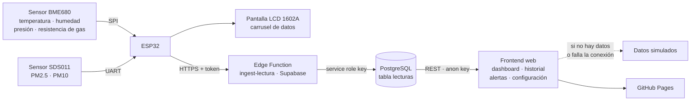

<div align="center">

# EcoNodo

### Sistema IoT de monitoreo ambiental

Una plataforma que captura variables ambientales mediante un ESP32,
almacena las lecturas en Supabase y las presenta en un dashboard web.


</div>

---

## Presentación

EcoNodo es un sistema de monitoreo ambiental de extremo a extremo: desde el sensor
físico hasta el navegador. Un ESP32 lee variables del entorno (temperatura, humedad,
presión atmosférica, partículas PM2.5/PM10 y compuestos orgánicos volátiles) a través
de dos sensores —un BME680 y un SDS011— y muestra un resumen accesible en una pantalla
LCD 1602A integrada en el propio nodo.

Cada cierto intervalo, el ESP32 envía las lecturas mediante HTTPS a una Edge Function
de Supabase, que valida el origen de los datos y los inserta en una base de datos
PostgreSQL. Desde ahí, una aplicación web estática (HTML, JavaScript y SCSS) consulta
esas lecturas y las presenta en cuatro vistas: un dashboard en vivo, un historial con
gráficas, un panel de alertas y una página de configuración local.

Este repositorio reúne tanto el firmware del nodo como el frontend que lo acompaña, y
documenta en `docs/` las decisiones técnicas tomadas durante su desarrollo —incluyendo
correcciones de hardware y cambios de diseño— como evidencia del proceso de trabajo,
no solo del resultado final.

## Problema que aborda

Monitorear variables ambientales (calidad del aire, temperatura, humedad) suele requerir
equipos costosos o paneles poco accesibles para personas sin experiencia técnica. EcoNodo
explora una alternativa de bajo costo: un microcontrolador con sensores económicos, una
nube gestionada y una interfaz web simple, capaz de mostrar el estado del entorno tanto
en una pantalla física como en cualquier navegador.

## Solución propuesta

EcoNodo combina cuatro capas que trabajan en conjunto:

- **Hardware y firmware**: un ESP32 con sensores BME680 (temperatura, humedad,
  presión y resistencia de gas) y SDS011 (partículas), más una pantalla LCD 1602A
  para mostrar el estado del nodo sin necesidad de un dispositivo adicional.
- **Nube**: una Edge Function de Supabase que actúa como puerta de entrada autenticada
  hacia una base de datos PostgreSQL, validando cada lectura antes de almacenarla.
- **Frontend web**: una aplicación estática que consulta esas lecturas mediante la API
  REST de Supabase y las presenta en un dashboard, un historial con gráficas, un panel
  de alertas y una página de configuración.
- **Resiliencia por diseño**: si no hay un nodo físico conectado o la conexión a
  Supabase falla, el frontend recurre automáticamente a datos simulados, de modo que la
  aplicación siempre es navegable —útil tanto para desarrollo como para demostraciones.

## Demostración

> El despliegue en GitHub Pages del repositorio personal se encuentra pendiente de
> activación.

El proyecto está preparado para desplegarse como sitio estático (no requiere paso de
build para HTML/JS), pero la activación de GitHub Pages para este repositorio aún no
se ha completado.

## Capturas del proyecto

<!-- TODO: Agregar captura del modal introductorio del dashboard -->
<!-- TODO: Agregar captura del dashboard con las tarjetas de sensores -->
<!-- TODO: Agregar captura del historial con las gráficas de Chart.js -->
<!-- TODO: Agregar captura del panel de alertas -->
<!-- TODO: Agregar captura de la página de configuración -->
<!-- TODO: Agregar fotografía del nodo ESP32 con los sensores y la pantalla LCD -->
<!-- TODO: Agregar fotografía o video corto de la pantalla LCD mostrando el carrusel de datos -->

## Funcionalidades

- Lectura de **temperatura**, **humedad**, **presión atmosférica**, **PM2.5**, **PM10**
  y **resistencia de gas** (mostrada como un indicador relativo de compuestos orgánicos
  volátiles, no como una medición certificada de concentración química), con cálculo de
  un índice de calidad del aire.
- Envío periódico de lecturas del ESP32 a Supabase mediante una Edge Function
  autenticada por token, con reintentos ante fallos de conexión.
- **Dashboard** con tarjetas en vivo que se actualizan automáticamente y muestran el
  estado de cada variable (bueno, moderado, alto, crítico, etc.).
- **Historial** con cuatro gráficas (Chart.js) y filtros por período (Hoy, 7 días,
  30 días, Todo).
- **Alertas** generadas según umbrales configurables, con indicador visual, sonido
  opcional y autodesaparición tras un tiempo configurable.
- **Configuración local**: las preferencias del usuario (umbrales de alerta, tipos de
  alerta activos, sonido y duración de las notificaciones) se guardan y se leen
  mediante `localStorage` del navegador, sin necesidad de una cuenta ni de un backend
  adicional.
- **Pantalla LCD 1602A** en el propio nodo, con un carrusel de páginas y un efecto de
  texto en movimiento (*marquee*) no bloqueante, pensado para mostrar información en
  lenguaje sencillo a personas sin conocimientos técnicos.
- **Modo de datos simulados**: si Supabase no está configurado o la petición falla, la
  aplicación genera datos de ejemplo automáticamente, permitiendo navegar la interfaz
  sin un nodo físico activo.
- Sitio estático listo para **GitHub Pages** (sin paso de build para HTML/JS).

## Arquitectura



**Cómo se explica cada paso, en términos sencillos:**

1. Los dos sensores entregan sus mediciones al ESP32 a través de sus propios protocolos
   de comunicación (SPI y UART).
2. El ESP32 calcula un estado general (por ejemplo, "Bueno" o "Crítico" para la calidad
   del aire), lo muestra en su pantalla LCD y, cada cierto intervalo, lo envía por
   internet a una función en la nube.
3. Esa función (la "Edge Function") revisa que la petición venga del nodo correcto
   —usando un token secreto— y que los datos tengan el formato esperado antes de
   guardarlos en la base de datos.
4. El sitio web consulta esa misma base de datos mediante una clave pública de solo
   lectura y construye el dashboard, el historial, las alertas y la configuración.
5. Si por algún motivo no hay datos disponibles (el nodo está apagado, no hay conexión,
   etc.), el sitio genera datos de ejemplo para seguir siendo navegable.

## Tecnologías

**Hardware y firmware**
- ESP32 (microcontrolador con WiFi)
- Sensor ambiental BME680 (temperatura, humedad, presión y resistencia de gas — vía SPI)
- Sensor de partículas SDS011 (PM2.5 / PM10 — vía UART)
- Pantalla LCD 1602A paralela (HD44780, librería `LiquidCrystal`)
- Arduino (lenguaje y entorno de desarrollo del firmware)

**Backend y nube**
- Supabase (Edge Functions sobre Deno, API REST/PostgREST, autenticación por clave)
- PostgreSQL (base de datos administrada por Supabase)

**Frontend**
- HTML5 y JavaScript (sin framework ni *bundler*, módulos cargados directamente)
- Sass/SCSS, compilado con Gulp
- Chart.js (gráficas del historial, cargado desde un CDN)
- Web Audio API (sonido opcional de alertas)
- `localStorage` (persistencia de preferencias del usuario en el navegador)

**Despliegue**
- GitHub Pages (sitio estático)

## Hardware utilizado

- **ESP32** — microcontrolador con WiFi integrado, cerebro del nodo.
- **Sensor BME680** — temperatura, humedad, presión atmosférica y resistencia de gas,
  utilizada como indicador relativo de compuestos orgánicos volátiles (no como una
  medición certificada de concentración química), conectado por **SPI**.
- **Sensor SDS011** — partículas finas PM2.5 y PM10, conectado por **UART**
  (`Serial2` del ESP32).
- **Pantalla LCD 1602A** (16 columnas × 2 filas) — controlador HD44780, en modo
  **paralelo de 4 bits**, manejada con la librería `LiquidCrystal`.
- **Potenciómetro B100K** — ajusta el contraste de la LCD a través de su pin `VO`.
- Resistencia limitadora (33–100 Ω) para el retroiluminado de la LCD (`A`/`LED+`).

## Conexiones principales

```
LCD 1602A (HD44780, modo paralelo de 4 bits — librería LiquidCrystal)
  RS         → GPIO 13
  E          → GPIO 14
  D4         → GPIO 25
  D5         → GPIO 26
  D6         → GPIO 27
  D7         → GPIO 32
  D0–D3      → sin conectar (no se usan en modo de 4 bits)
  RW         → GND
  VO         → terminal central de un potenciómetro B100K
               (los extremos del potenciómetro van a 5V y GND; ajusta el contraste)
  A / LED+   → 5V, a través de una resistencia limitadora de 33–100 Ω
  K / LED-   → GND

Sensor BME680 (SPI)
  SCK        → GPIO 18
  MISO       → GPIO 19
  MOSI       → GPIO 23
  CS         → GPIO 5
  VCC        → 3.3V

Sensor SDS011 (UART — Serial2 del ESP32)
  TX (SDS011) → GPIO 16  (entrada RX2 del ESP32)
  RX (SDS011) → GPIO 17  (salida TX2 del ESP32)
  VCC         → 5V
```

> Todos los módulos deben compartir el mismo **GND** con el ESP32. El mapeo de pines
> está definido como constantes al inicio de `econodo_esp32.ino` y documentado también
> en los comentarios del propio archivo.

## Mi contribución

Este proyecto partió de una base creada por otra desarrolladora (páginas iniciales del
frontend y estructura básica). A partir de ahí, mi trabajo se centró en construir todo
lo necesario para convertirlo en un sistema IoT funcional de extremo a extremo:

- Diseño e implementación de la **capa de datos del frontend** (`js/api.js`), incluyendo
  el mecanismo de *fallback* a datos simulados.
- Conexión del frontend a **Supabase** mediante su API REST.
- Diseño e implementación de la **Edge Function `ingest-lectura`**, incluyendo
  validación de token, payload y estado antes de insertar en la base de datos.
- Desarrollo completo del **firmware del ESP32**: lectura de los sensores BME680 y
  SDS011, cálculo del estado de calidad del aire, integración y depuración de la
  pantalla LCD 1602A (incluyendo la corrección de un primer intento erróneo con módulo
  I2C), el carrusel de páginas con efecto *marquee*, y el envío periódico de lecturas
  con manejo de reintentos.
- Mejoras sustanciales al frontend existente: estados visuales de los sensores,
  panel de alertas con umbrales configurables, filtros y gráficas del historial,
  página de configuración funcional con `localStorage`, modal introductorio responsive,
  accesibilidad básica y preparación del proyecto para su despliegue en GitHub Pages.
- Documentación técnica del proceso de desarrollo en `docs/`, registrando decisiones,
  errores corregidos y cambios de diseño con su razonamiento.

El historial de commits de este repositorio refleja esta división del trabajo de forma
transparente.

## Decisiones técnicas destacadas

- **Edge Function como puerta de entrada, no acceso directo a la base de datos**: el
  ESP32 nunca habla directamente con PostgreSQL. Envía sus lecturas por HTTPS a una
  Edge Function (`ingest-lectura`) que valida un token secreto, la forma del payload y
  los valores de estado antes de insertar — así la base de datos nunca recibe datos sin
  validar ni queda expuesta a un dispositivo de campo.
- **Frontend siempre navegable**: en lugar de mostrar una pantalla vacía o un error
  cuando no hay un nodo físico conectado, el frontend recurre a datos simulados
  (`generarDatosFake` / `generarDatosFakeHistorial`). Esto permite demostrar la
  aplicación completa sin depender del hardware.
- **Corrección consciente del módulo de LCD**: el primer intento de integración usó un
  módulo I2C (`LiquidCrystal_I2C`); al no funcionar de forma confiable, se migró a una
  conexión paralela directa con el controlador HD44780 (`LiquidCrystal`), documentando
  el cambio y su razonamiento en `docs/lcd-paralela-cambios.md`.
- **Lenguaje simple en la pantalla del nodo**: el carrusel de la LCD muestra los estados
  con palabras como "Bueno" o "Crítico" en lugar de solo cifras técnicas, pensando en que
  el nodo pueda ser leído por personas sin conocimientos técnicos.
- **Sitio estático sin *bundler***: el frontend se construye con HTML, JS y SCSS
  directos (sin frameworks ni paso de build para HTML/JS), lo que simplifica el
  despliegue en GitHub Pages y reduce la superficie de mantenimiento.

## Retos resueltos

- **Migración del módulo LCD (I2C → paralelo HD44780)**: el módulo I2C inicial generaba
  caracteres ilegibles de forma intermitente. Se diagnosticó como un problema de
  compatibilidad/dirección del adaptador y se resolvió cambiando a una conexión paralela
  de 4 bits directa con los pines del ESP32 (ver `docs/lcd-paralela-cambios.md`).
- **Carrusel de datos no bloqueante (*marquee* continuo)**: la primera versión del
  carrusel mostraba páginas estáticas; se rediseñó como una máquina de estados
  (`LCD_SCROLLING` / `LCD_PAUSA`) que desplaza el texto de forma continua sin bloquear
  el resto del `loop()` del firmware (ver `docs/lcd-marquee-carrusel.md`).
- **Responsividad del modal introductorio en móvil**: el primer modal tenía problemas de
  desbordamiento y alturas incorrectas en pantallas pequeñas; se corrigió con un enfoque
  *mobile-first* usando `clamp()`, unidades `dvh` y control de `overflow-x`
  (ver `docs/cambios-marquee-y-modal-responsive.md`).
- **Envío HTTP bloqueante del ESP32 — mitigado, no resuelto del todo**: `HTTPClient.POST()`
  bloquea el `loop()` mientras espera respuesta del servidor, lo que puede congelar
  momentáneamente el carrusel de la LCD durante el envío. Se mitigó ajustando los
  tiempos de espera (`setTimeout(5000)`, `setConnectTimeout(3000)`) y limitando los
  reintentos a 3 intentos, pero la llamada **sigue siendo bloqueante por naturaleza** —
  una solución completa requeriría un enfoque asíncrono (por ejemplo, `AsyncHTTPRequest`
  o mover el envío a una tarea independiente con FreeRTOS). Esto queda registrado como
  mejora pendiente, no como problema resuelto.

## Aprendizajes

- Integrar sensores con protocolos distintos (SPI y UART) en el mismo microcontrolador y
  depurar problemas de hardware reales (como el módulo LCD I2C defectuoso) en lugar de
  solo lógica de software.
- Diseñar una capa de datos con *fallback* explícito, de forma que la ausencia de
  backend o de hardware no rompa la experiencia de quien usa o revisa el proyecto.
- Trabajar con Supabase de extremo a extremo: Edge Functions en Deno/TypeScript, su API
  REST (PostgREST) y el modelo de seguridad basado en claves públicas (`anon`) más
  Row Level Security — y entender por qué ese modelo es seguro solo si las políticas
  están bien definidas.
- Documentar decisiones técnicas *mientras* se toman (no después), incluyendo los
  intentos fallidos y su corrección, como evidencia del proceso real de desarrollo.
- Diseñar para personas sin conocimientos técnicos: traducir valores numéricos de
  sensores a estados en lenguaje simple, tanto en la pantalla LCD como en el dashboard.

## Cómo ejecutarlo

El frontend es un sitio estático: no requiere servidor ni paso de build para HTML o
JavaScript. Solo es necesario compilar las hojas de estilo SCSS.

```bash
# Clonar el repositorio
git clone https://github.com/JazielAguirre/EcoNodo.git
cd EcoNodo

# Instalar dependencias
npm install

# Compilar SCSS una vez
npm run sass

# Compilar y observar cambios en SCSS durante el desarrollo
npm run dev
```

Después, basta con abrir `index.html` en un navegador (o servirlo con cualquier
servidor estático).

### Configurar la conexión a Supabase (opcional)

Por defecto, el frontend funciona con **datos simulados**. Para conectarlo a una
instancia real de Supabase:

1. Copia `js/config.example.js` a `js/config.js`.
2. Completa `SUPABASE_URL` y `SUPABASE_ANON_KEY` con los valores de tu proyecto.
3. Cambia `USE_SUPABASE` a `true`.

`js/config.js` está pensado para contener la **clave pública (`anon key`)** de
Supabase —diseñada para exponerse en aplicaciones cliente y protegida mediante
políticas de Row Level Security en la base de datos—, nunca claves privadas o de
administración.

### Configurar el firmware del ESP32 (opcional)

El firmware vive en `firmware/econodo_esp32/`. Para compilarlo:

1. Copia `secrets.example.h` a `secrets.h`.
2. Completa tus credenciales de WiFi y el token secreto del nodo
   (`NODO_SECRET_TOKEN`), que debe coincidir con el configurado en la Edge Function.
3. Abre `econodo_esp32.ino` con el IDE de Arduino (o PlatformIO), revisa el mapeo de
   pines documentado en los comentarios del archivo y súbelo al ESP32.

`secrets.h` está excluido del control de versiones; nunca debe compartirse ni subirse
al repositorio.

## Seguridad

- **Secretos fuera del repositorio**: `secrets.h` (credenciales WiFi y token del nodo),
  los `.env` de las Edge Functions, `.mcp.json` y el archivo de contraseña de Supabase
  están listados en `.gitignore` y no se versionan. El patrón `*.example.*`
  (`secrets.example.h`, `js/config.example.js`) documenta la forma esperada de cada
  archivo sin exponer valores reales.
- **`js/config.js` contiene una clave pública (`anon`), no una clave administrativa**:
  es la clave diseñada por Supabase para usarse en aplicaciones cliente — cualquier
  persona que abra las herramientas de desarrollador del navegador puede verla, y eso es
  parte esperada de su modelo de seguridad. **Su exposición solo es aceptable si las
  políticas de Row Level Security (RLS) de la base de datos restringen correctamente el
  acceso** (por ejemplo, limitando esa clave a operaciones de solo lectura sobre la
  tabla `lecturas`). Verificar esas políticas en el panel de Supabase queda fuera del
  alcance de este repositorio, pero es la pieza que confirma que la exposición de la
  clave es segura en la práctica.
- **El ESP32 nunca tiene acceso directo a la base de datos**: solo puede llegar a ella a
  través de la Edge Function `ingest-lectura`, que valida un token secreto y la forma de
  cada lectura antes de insertarla — el dispositivo de campo nunca posee credenciales de
  administración.

## Estructura del repositorio

```
econodo/
├── index.html, historial.html, alertas.html, configuracion.html   # Páginas del frontend
├── js/                                                             # Lógica del frontend
│   ├── api.js            # Capa de datos (Supabase + fallback simulado)
│   ├── app.js            # Dashboard, alertas y estado de sensores
│   ├── historial.js      # Gráficas e historial con filtros
│   ├── configuracion.js  # Preferencias del usuario en localStorage
│   └── modal-intro.js    # Modal introductorio
├── src/scss/                                                       # Estilos (SCSS modular)
├── build/css/                                                      # CSS compilado
├── firmware/econodo_esp32/                                         # Firmware del ESP32 (Arduino)
├── supabase/functions/ingest-lectura/                              # Edge Function (Deno/TypeScript)
├── docs/                                                           # Documentación técnica del proceso
└── gulpfile.js, package.json                                       # Configuración del proyecto
```

## Documentación adicional

La carpeta [`docs/`](docs/) contiene registros técnicos del proceso de desarrollo:
decisiones de diseño, correcciones de hardware (por ejemplo, el cambio de una pantalla
LCD con módulo I2C a una pantalla paralela HD44780) y cambios de interfaz, junto con el
razonamiento detrás de cada uno. También incluye [`revision-portafolio.md`](docs/revision-portafolio.md),
una revisión del propio repositorio orientada a su presentación como portafolio.

## Estado del proyecto

**Funcional**
- Firmware del ESP32: lectura de sensores, cálculo de estados, carrusel en LCD y envío
  periódico a Supabase con reintentos.
- Edge Function `ingest-lectura`: validación de token, payload y estado antes de insertar.
- Frontend completo: dashboard en vivo, historial con gráficas y filtros, panel de
  alertas con umbrales configurables, página de configuración con `localStorage`.
- Capa de datos con *fallback* automático a datos simulados.

**En mejora**
- Envío HTTP del ESP32: actualmente bloqueante (mitigado con timeouts y reintentos, pero
  no resuelto de forma asíncrona — ver "Retos resueltos").
- Recursos visuales del repositorio: capturas de pantalla y fotografías del nodo físico
  pendientes de agregar (ver "Capturas del proyecto").
- Activación de GitHub Pages para el repositorio personal.

**Planeado**
- Agregar un archivo de licencia.
- Dejar de versionar `node_modules/` (comando documentado en
  [`docs/revision-portafolio.md`](docs/revision-portafolio.md)).
- Confirmar en el panel de Supabase que las políticas de Row Level Security acotan
  correctamente el acceso de la clave pública usada por el frontend.

## Próximas mejoras

- Resolver de forma definitiva el envío HTTP bloqueante del ESP32 (por ejemplo, con una
  librería de HTTP asíncrono o moviendo el envío a una tarea independiente con FreeRTOS).
- Agregar las capturas de pantalla y fotografías del nodo pendientes.
- Activar GitHub Pages y actualizar el enlace de demostración.
- Agregar un archivo `LICENSE`.
- Dejar de versionar `node_modules/` siguiendo la recomendación documentada.
- Auditar las políticas de Row Level Security del proyecto de Supabase.

## Autor

**Jaziel Aguirre**  
Estudiante de Ingeniería de Software

- GitHub: [@JazielAguirre](https://github.com/JazielAguirre)

## Créditos

El repositorio se originó como un proyecto académico compartido y conserva los
commits iniciales de **Neyra López**.

El desarrollo principal posterior de EcoNodo —incluyendo la arquitectura,
integración IoT, firmware del ESP32, conexión con Supabase, Edge Function,
frontend, despliegue y documentación técnica— fue realizado por
**Jaziel Aguirre**.

El historial de Git se conserva sin reescrituras para mantener transparente la
autoría de cada contribución.

## Licencia

Este repositorio no incluye actualmente un archivo `LICENSE`. Hasta que se agregue uno de
forma explícita, el código se comparte únicamente con fines de demostración y portafolio;
no se otorga ninguna licencia de uso, copia, modificación o distribución sobre él.
